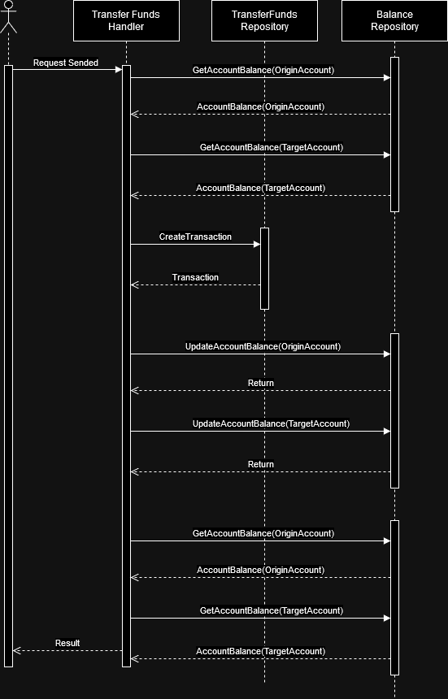
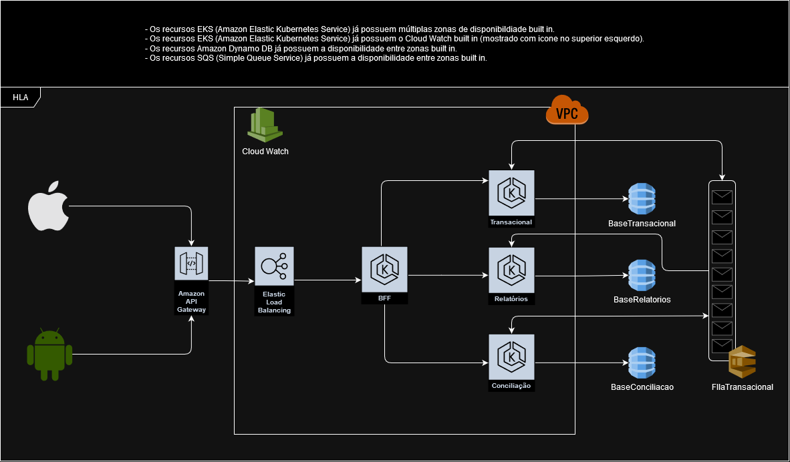

# TransacaoFinanceira
Case para refatoração

Passos a implementar:
1. Corrija o que for necessario para resolver os erros de compilação.
2. Execute o programa para avaliar a saida, identifique e corrija o motivo de algumas transacoes estarem sendo canceladas mesmo com saldo positivo e outras sem saldo sendo efetivadas.
> No primeiro commit foi feita a correção. Nos seguintes a refatoração.
3. Aplique o code review e refatore conforme as melhores praticas(SOLID,Patterns,etc).
4. Implemente os testes unitários que julgar efetivo.
5. Crie um git hub e compartilhe o link respondendo o ultimo e-mail.

Obs: Voce é livre para implementar na linguagem de sua preferência desde que respeite as funcionalidades e saídas existentes, além de aplicar os conceitos solicitados.

# Como rodar

Para executar a aplicação se faz necessário o uso do [.Net Framework 8](https://dotnet.microsoft.com/pt-br/download/dotnet/8.0). Após a sua instalação utilize os seguintes comandos via CLI:

```
dotnet restore
```

E após o download dos pacotes utilize o comando abaixo:

```
dotnet build
dotnet run
```

> Todos os comandos devem ser executados na pasta onde esta o CSProj de entrypoint da aplicação

# Aplicação
## Arquitetura

A aplicação foi criada usando um entrypoint de *consoleApp* apontando para uma *biblioteca de classes*. Caso se faça necessário, a aplicação é modular o suficiente
para suportar um entrypoint de API ou até mesmo uma fila. O padrão escolhido para a organização do projeto foi o [Vertical Slice](https://en.wikipedia.org/wiki/Vertical_slice), 
onde a estrutura de pastas se encontra da seguinte forma:

```
Src
├───Application
│   ├───Shared
│   │   ├───Models
│   │   └───Repositories
│   │       └───Interfaces
│   └───UseCases
│       └───AccountsFundsTransfer
│           ├───Constants
│           ├───Models
│           ├───Repository
│           │   └───Interfaces
│           └───UseCase
│               └───Interfaces
├───Entrypoints
│   └───TransacaoFinanceira
└───Tests
    └───TransacaoFinanceiraTests
        └───Static
```

## Padrões/Técnicas de desenvolvimento utilizados

- Single Responsability Principle
- Dependecy Injection
- Object Calisthenics
- Repository Pattern

## Diagrama de sequencia



## Pacotes Utilizados

- [Moq](https://www.nuget.org/packages/Moq/) - Utilizado para fazer Mocks de testes unitários
- [xUnit](https://www.nuget.org/packages/xunit) - Framework de testes unitários

# Proposta de arquitetura em nuvem

